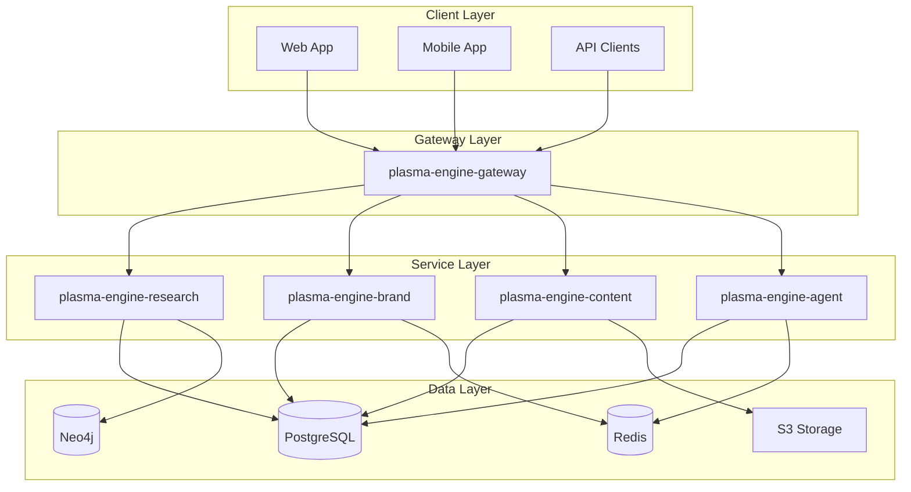

# Plasma Engine Organization

## 🚀 Organization Overview

**Plasma Engine** is a modular, enterprise-grade platform delivering AI-powered research automation, brand intelligence, content workflows, and agent orchestration.

## 📂 Repository Structure

### Core Services
- **[plasma-engine-gateway](./plasma-engine-gateway)** - Unified API Gateway & GraphQL Federation
- **[plasma-engine-research](./plasma-engine-research)** - GraphRAG & Knowledge Management System
- **[plasma-engine-brand](./plasma-engine-brand)** - Brand Monitoring & Analytics Platform
- **[plasma-engine-content](./plasma-engine-content)** - AI Content Generation & Publishing
- **[plasma-engine-agent](./plasma-engine-agent)** - Agent Orchestration & Automation

### Infrastructure & Shared
- **[plasma-engine-shared](./plasma-engine-shared)** - Shared Libraries & Templates
- **[plasma-engine-infra](./plasma-engine-infra)** - Infrastructure as Code & CI/CD

## 🏗️ Architecture



## 🛠️ Technology Stack

### Backend
- **Languages**: Python 3.11+, TypeScript
- **Frameworks**: FastAPI, Apollo Server
- **Databases**: PostgreSQL, Redis, Neo4j
- **Message Queue**: Kafka, Celery

### AI/ML
- **LLMs**: OpenAI GPT-4, Anthropic Claude
- **Embeddings**: OpenAI, Sentence-Transformers
- **Frameworks**: LangChain, LlamaIndex
- **Vector DB**: pgvector, Pinecone

### Infrastructure
- **Container**: Docker, Kubernetes
- **CI/CD**: GitHub Actions, ArgoCD
- **Monitoring**: Prometheus, Grafana
- **Cloud**: AWS/Azure/GCP

## 📋 Development Process

### Branching Strategy
- `main` - Production-ready code
- `develop` - Integration branch
- `feature/*` - Feature development
- `hotfix/*` - Emergency fixes

### Code Review
- All PRs require approval
- CodeRabbit automated review
- CODEOWNERS enforcement
- Security scanning

### Release Process
- Semantic versioning
- Automated changelog
- Tagged releases
- Rollback capability

## 🚦 Getting Started

### Prerequisites
- Docker Desktop
- Python 3.11+
- Node.js 20+
- Git

### Quick Start
```bash
# Clone all repositories
git clone https://github.com/plasma-engine/plasma-engine-gateway.git
git clone https://github.com/plasma-engine/plasma-engine-research.git
git clone https://github.com/plasma-engine/plasma-engine-brand.git
git clone https://github.com/plasma-engine/plasma-engine-content.git
git clone https://github.com/plasma-engine/plasma-engine-agent.git
git clone https://github.com/plasma-engine/plasma-engine-shared.git
git clone https://github.com/plasma-engine/plasma-engine-infra.git

# Start local environment
cd plasma-engine-infra
docker-compose up -d

# Run all services
make run-all
```

## 📊 Project Management

### Phase Status
- ✅ **Phase 0**: Infrastructure Setup (Complete)
- 🚧 **Phase 1**: Core Services (In Progress)
- 📅 **Phase 2**: Advanced Features (Planned)
- 📅 **Phase 3**: Enterprise Features (Planned)

### Sprint Schedule
- **Sprint Duration**: 2 weeks
- **Sprint Planning**: Mondays
- **Daily Standups**: 10 AM
- **Sprint Review**: Every 2nd Friday
- **Retrospective**: Every 2nd Friday

## 👥 Team Structure

### Codeowners
- **Platform Team**: Infrastructure, Gateway
- **AI Team**: Research, Agent
- **Product Team**: Brand, Content
- **DevOps Team**: CI/CD, Monitoring

### Communication
- **Slack**: #plasma-engine
- **GitHub Discussions**: Technical decisions
- **Jira**: Sprint tracking
- **Confluence**: Documentation

## 📚 Documentation

### Technical Docs
- [Architecture Decision Records](./docs/adrs/)
- [API Documentation](./docs/api/)
- [Development Handbook](./docs/development-handbook.md)
- [DevOps Playbook](./docs/devops-process.md)

### Guides
- [Contributing Guide](./CONTRIBUTING.md)
- [Security Policy](./SECURITY.md)
- [Code of Conduct](./CODE_OF_CONDUCT.md)
- [License](./LICENSE)

## 🔒 Security

### Reporting
Report security vulnerabilities to: security@plasma-engine.org

### Policies
- Dependency scanning
- SAST/DAST testing
- Security reviews
- Penetration testing

## 📈 Metrics & Monitoring

### SLOs
- **Uptime**: 99.9%
- **API Latency**: < 500ms p95
- **Error Rate**: < 0.1%

### Dashboards
- [Service Health](https://monitoring.plasma-engine.org)
- [Performance Metrics](https://metrics.plasma-engine.org)
- [Cost Analysis](https://costs.plasma-engine.org)

## 🤝 Contributing

We welcome contributions! Please see our [Contributing Guide](./CONTRIBUTING.md) for details.

### How to Contribute
1. Fork the repository
2. Create a feature branch
3. Make your changes
4. Submit a pull request
5. Wait for review

## 📞 Support

### Resources
- **Documentation**: https://docs.plasma-engine.org
- **Issues**: GitHub Issues
- **Discussions**: GitHub Discussions
- **Email**: support@plasma-engine.org

### SLA
- **Critical**: 4 hours
- **High**: 1 business day
- **Medium**: 3 business days
- **Low**: 5 business days

## 📄 License

Copyright © 2025 Plasma Engine Organization. All rights reserved.

---

**Last Updated**: September 25, 2025  
**Version**: 1.0.0  
**Status**: Active Development
