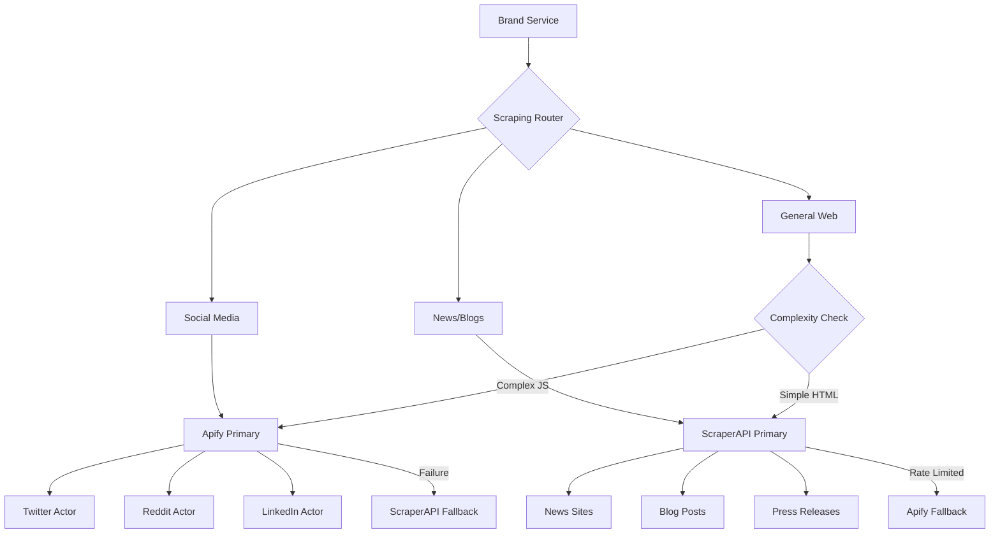

# 🕷️ Web Scraping Architecture - Apify + ScraperAPI + BrightData

## Overview
Plasma Engine uses a triple-scraping strategy with Apify as primary, ScraperAPI as secondary, and BrightData as enterprise fallback.

## 🎯 Service Comparison & Best Use Cases

### Apify (Primary - Social Media)
**Best for:**
- ✅ **Social media scraping** (Twitter/X, Reddit, LinkedIn, Instagram)
- ✅ **Complex JavaScript sites** with interaction needs
- ✅ **Structured data extraction** with pre-built actors
- ✅ **Large-scale crawling** with built-in queue management

**Limitations:**
- ❌ More expensive per request
- ❌ Requires actor-specific knowledge
- ❌ Limited for simple HTML scraping

### ScraperAPI (Secondary - General Web)
**Best for:**
- ✅ **Simple HTML scraping** (news sites, blogs, documentation)
- ✅ **High-volume requests** (100K+ requests/month plans)
- ✅ **Geographic targeting** (100+ country proxies)
- ✅ **Rendered JavaScript** without complex interactions
- ✅ **Quick fallback** when Apify actors fail

**Limitations:**
- ❌ No pre-built social media scrapers
- ❌ Cannot bypass Twitter/LinkedIn protections
- ❌ Less suitable for complex interactions
- ❌ No built-in data transformation

### BrightData (Enterprise Fallback)
**Best for:**
- ✅ **Twitter/X scraping** when others fail
- ✅ **LinkedIn with full profiles**
- ✅ **Cloudflare bypass** (Web Unlocker)
- ✅ **Residential proxies** (72M+ IPs)
- ✅ **Mobile proxies** for app scraping
- ✅ **Pre-collected datasets**

**Limitations:**
- ❌ Most expensive option ($15/GB residential)
- ❌ Requires account setup and zones
- ❌ Overkill for simple scraping

## 🏗️ Integration Architecture



## 📦 Implementation Strategy

### 1. Service Selection Logic

```python
# plasma-engine-brand/app/scrapers/router.py

from enum import Enum
from typing import Optional, Dict, Any

class ScraperType(Enum):
    APIFY = "apify"
    SCRAPER_API = "scraper_api"
    BOTH = "both"

class ScrapingRouter:
    """Intelligent routing between Apify and ScraperAPI"""

    # Service mapping by domain/purpose
    ROUTING_RULES = {
        # Social Media - Always Apify first
        "twitter.com": ScraperType.APIFY,
        "x.com": ScraperType.APIFY,
        "reddit.com": ScraperType.APIFY,
        "linkedin.com": ScraperType.APIFY,
        "instagram.com": ScraperType.APIFY,

        # News Sites - ScraperAPI first (better for high volume)
        "techcrunch.com": ScraperType.SCRAPER_API,
        "theverge.com": ScraperType.SCRAPER_API,
        "reuters.com": ScraperType.SCRAPER_API,
        "bloomberg.com": ScraperType.SCRAPER_API,

        # General sites - Evaluate complexity
        "default": ScraperType.BOTH
    }

    @classmethod
    def select_scraper(
        cls,
        url: str,
        requires_js: bool = False,
        requires_interaction: bool = False,
        geographic_target: Optional[str] = None
    ) -> ScraperType:
        """Select the best scraper for the job"""

        domain = extract_domain(url)

        # Check explicit rules
        if domain in cls.ROUTING_RULES:
            return cls.ROUTING_RULES[domain]

        # Complex interactions = Apify
        if requires_interaction:
            return ScraperType.APIFY

        # Geographic targeting = ScraperAPI (better proxy coverage)
        if geographic_target:
            return ScraperType.SCRAPER_API

        # Simple HTML = ScraperAPI (more cost-effective)
        if not requires_js:
            return ScraperType.SCRAPER_API

        # Default to both with fallback
        return ScraperType.BOTH
```

### 2. Apify Integration (Primary for Social)

```python
# plasma-engine-brand/app/scrapers/apify_client.py

import os
from apify_client import ApifyClient
from typing import Dict, Any, Optional

class ApifyScraper:
    """Apify client for social media and complex scraping"""

    def __init__(self):
        self.client = ApifyClient(os.getenv("APIFY_TOKEN"))

        # Actor IDs for different platforms
        self.actors = {
            "twitter": "quacker/twitter-scraper",
            "reddit": "trudax/reddit-scraper",
            "linkedin": "anchor/linkedin-scraper",
            "instagram": "apify/instagram-scraper"
        }

    async def scrape_social(
        self,
        platform: str,
        query: str,
        max_items: int = 100
    ) -> Dict[str, Any]:
        """Scrape social media platform"""

        actor_id = self.actors.get(platform)
        if not actor_id:
            raise ValueError(f"No actor for platform: {platform}")

        run_input = self._build_input(platform, query, max_items)

        try:
            run = self.client.actor(actor_id).call(run_input=run_input)
            return self._process_results(run)
        except Exception as e:
            # Log error and trigger fallback
            logger.error(f"Apify failed: {e}")
            raise ScrapingError(f"Apify failed: {e}", fallback="scraper_api")
```

### 3. ScraperAPI Integration (Fallback/Complement)

```python
# plasma-engine-brand/app/scrapers/scraperapi_client.py

import os
import httpx
from typing import Dict, Any, Optional
from urllib.parse import urlencode

class ScraperAPIClient:
    """ScraperAPI client for general web scraping"""

    BASE_URL = "http://api.scraperapi.com"

    def __init__(self):
        self.api_key = os.getenv("SCRAPERAPI_KEY")
        self.session = httpx.AsyncClient(timeout=30)

    async def scrape(
        self,
        url: str,
        render_js: bool = False,
        country_code: Optional[str] = None,
        premium_proxy: bool = False,
        retry_on_failure: bool = True
    ) -> str:
        """Scrape a URL with ScraperAPI"""

        params = {
            "api_key": self.api_key,
            "url": url,
            "render": str(render_js).lower(),
            "retry_404": "true" if retry_on_failure else "false"
        }

        # Add optional parameters
        if country_code:
            params["country_code"] = country_code

        if premium_proxy:
            params["premium"] = "true"

        try:
            response = await self.session.get(
                self.BASE_URL,
                params=params
            )
            response.raise_for_status()
            return response.text
        except httpx.HTTPError as e:
            logger.error(f"ScraperAPI failed: {e}")
            raise ScrapingError(f"ScraperAPI failed: {e}", fallback="apify")

    async def scrape_batch(
        self,
        urls: list[str],
        **kwargs
    ) -> Dict[str, str]:
        """Batch scrape multiple URLs"""

        # ScraperAPI's batch endpoint for efficiency
        batch_url = f"{self.BASE_URL}/batch"

        payload = {
            "apiKey": self.api_key,
            "urls": urls,
            **kwargs
        }

        response = await self.session.post(batch_url, json=payload)
        return response.json()
```

### 4. Unified Scraping Interface with Fallback

```python
# plasma-engine-brand/app/scrapers/unified.py

from typing import Optional, Union, Dict, Any
import asyncio

class UnifiedScraper:
    """Unified scraping interface with intelligent fallback"""

    def __init__(self):
        self.apify = ApifyScraper()
        self.scraper_api = ScraperAPIClient()
        self.router = ScrapingRouter()

    async def scrape(
        self,
        url: str,
        **kwargs
    ) -> Union[str, Dict[str, Any]]:
        """Scrape with automatic service selection and fallback"""

        # Determine primary scraper
        scraper_type = self.router.select_scraper(url, **kwargs)

        # Try primary scraper
        try:
            if scraper_type == ScraperType.APIFY:
                return await self._scrape_with_apify(url, **kwargs)
            elif scraper_type == ScraperType.SCRAPER_API:
                return await self._scrape_with_scraper_api(url, **kwargs)
            else:
                # Try both with preference
                return await self._scrape_with_fallback(url, **kwargs)
        except ScrapingError as e:
            # Automatic fallback
            if e.fallback == "scraper_api":
                logger.info(f"Falling back to ScraperAPI for {url}")
                return await self._scrape_with_scraper_api(url, **kwargs)
            elif e.fallback == "apify":
                logger.info(f"Falling back to Apify for {url}")
                return await self._scrape_with_apify(url, **kwargs)
            else:
                raise

    async def monitor_social_mentions(
        self,
        brand_terms: list[str],
        platforms: list[str] = ["twitter", "reddit"]
    ) -> Dict[str, Any]:
        """Monitor brand mentions across social platforms"""

        results = {}

        for platform in platforms:
            for term in brand_terms:
                try:
                    # Use Apify for social media
                    data = await self.apify.scrape_social(
                        platform=platform,
                        query=term
                    )
                    results[f"{platform}_{term}"] = data
                except Exception as e:
                    # Fallback to ScraperAPI for public pages
                    if platform == "twitter":
                        url = f"https://twitter.com/search?q={term}"
                    elif platform == "reddit":
                        url = f"https://www.reddit.com/search/?q={term}"

                    try:
                        html = await self.scraper_api.scrape(
                            url=url,
                            render_js=True
                        )
                        results[f"{platform}_{term}_fallback"] = html
                    except:
                        logger.error(f"Both scrapers failed for {platform} {term}")

        return results
```

## 🔑 Adding ScraperAPI Key to GitHub Secrets

### Format for GitHub Secrets

Add your ScraperAPI key exactly as provided (no prefixes):

```bash
# Your ScraperAPI key looks like this:
# a1b2c3d4e5f6g7h8i9j0k1l2m3n4o5p6

# Add to GitHub secrets (organization or repository level)
gh secret set SCRAPERAPI_KEY --org Plasma-Engine --body "a1b2c3d4e5f6g7h8i9j0k1l2m3n4o5p6"

# Or for repository only:
gh secret set SCRAPERAPI_KEY --repo Plasma-Engine/plasma-engine-org --body "a1b2c3d4e5f6g7h8i9j0k1l2m3n4o5p6"
```

### Environment Variable Configuration

```env
# .env file for local development
APIFY_TOKEN=apify_api_AbCdEfGhIjKlMnOpQrStUvWxYz123456
SCRAPERAPI_KEY=a1b2c3d4e5f6g7h8i9j0k1l2m3n4o5p6
```

### GitHub Actions Usage

```yaml
# .github/workflows/scraping.yml
jobs:
  scrape:
    runs-on: ubuntu-latest
    steps:
      - name: Run Scraping Tasks
        env:
          APIFY_TOKEN: ${{ secrets.APIFY_TOKEN }}
          SCRAPERAPI_KEY: ${{ secrets.SCRAPERAPI_KEY }}
        run: |
          python -m plasma_engine_brand.scrapers
```

## 📊 Cost Optimization Strategy

### Monthly Budget Allocation

| Service | Use Case | Monthly Budget | Requests |
|---------|----------|---------------|----------|
| **Apify** | Social media monitoring | $49-99 | ~10K social posts |
| **ScraperAPI** | News/blogs/fallback | $49-99 | ~100K pages |

### Cost-Effective Routing

1. **Social Media** → Apify (specialized actors)
2. **News Sites** → ScraperAPI (simple HTML)
3. **Documentation** → ScraperAPI (static content)
4. **Complex JS** → Apify (browser automation)
5. **High Volume** → ScraperAPI (better pricing)

## 🚀 Implementation Priority

1. **Phase 1 - Week 1**: Add ScraperAPI key to secrets
2. **Phase 1 - Week 2**: Implement unified scraper interface
3. **Phase 1 - Week 3**: Add fallback logic and monitoring
4. **Phase 1 - Week 4**: Optimize routing rules based on usage

## 📈 Monitoring & Metrics

```python
# Track scraper performance
SCRAPER_METRICS = {
    "apify_success_rate": 0.0,
    "scraperapi_success_rate": 0.0,
    "fallback_triggered": 0,
    "cost_per_scrape": {
        "apify": 0.0,
        "scraperapi": 0.0
    },
    "average_response_time": {
        "apify": 0.0,
        "scraperapi": 0.0
    }
}
```

## 🔒 Security Considerations

1. **Never commit API keys** - Use GitHub Secrets
2. **Rate limit internally** - Prevent accidental overuse
3. **Validate URLs** - Prevent SSRF attacks
4. **Sanitize outputs** - Clean scraped data
5. **Monitor usage** - Set up alerts for unusual activity

## 📝 Quick Start

```bash
# 1. Add ScraperAPI key to GitHub secrets
gh secret set SCRAPERAPI_KEY --repo Plasma-Engine/plasma-engine-org

# 2. Update local .env
echo "SCRAPERAPI_KEY=your_key_here" >> .env

# 3. Test the integration
python -m plasma_engine_brand.scrapers.test_scraperapi
```

## 🎯 Benefits of Dual-Service Approach

1. **Redundancy** - Never blocked from scraping
2. **Cost Optimization** - Use the cheaper service per use case
3. **Specialization** - Best tool for each job
4. **Scalability** - Handle any volume of requests
5. **Geographic Coverage** - ScraperAPI's 100+ country proxies
6. **Social Media Excellence** - Apify's specialized actors