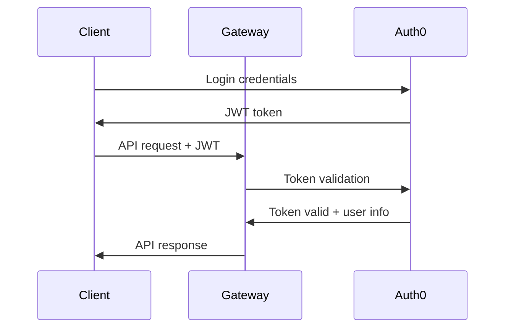

# Plasma Engine - API Reference

## Overview

The Plasma Engine API provides comprehensive access to all platform capabilities through a unified GraphQL federation layer. This document covers authentication, API endpoints, data models, and integration patterns.

## Base Information

- **Base URL**: `https://api.plasma-engine.com` (Production) | `http://localhost:3000` (Development)
- **Protocol**: GraphQL over HTTP/HTTPS
- **Authentication**: JWT Bearer tokens
- **Content Type**: `application/json`

## Authentication

### JWT Token Structure

All API requests require authentication via JWT Bearer tokens:

```http
Authorization: Bearer <jwt_token>
```

### Authentication Flow



### Token Refresh

```graphql
mutation RefreshToken($refreshToken: String!) {
  refreshToken(refreshToken: $refreshToken) {
    accessToken
    refreshToken
    expiresIn
  }
}
```

## GraphQL Schema Federation

The platform uses Apollo Federation to combine multiple service schemas:

### Gateway Schema

The gateway combines schemas from all services:

- **Gateway**: User management, authentication
- **Research**: Knowledge management, GraphRAG queries
- **Brand**: Brand monitoring, sentiment analysis
- **Content**: Content generation, publishing
- **Agent**: Multi-agent workflows, automation

## Core API Endpoints

### Gateway Service API

#### User Management

```graphql
# Get current user profile
query Me {
  me {
    id
    email
    name
    organization
    role
    permissions
    createdAt
    lastLoginAt
  }
}

# Update user profile
mutation UpdateProfile($input: UpdateProfileInput!) {
  updateProfile(input: $input) {
    id
    name
    email
    organization
  }
}
```

#### Organization Management

```graphql
# Get organization details
query Organization($id: ID!) {
  organization(id: $id) {
    id
    name
    plan
    memberCount
    apiUsage {
      current
      limit
      resetDate
    }
    settings {
      allowedDomains
      ssoEnabled
      mfaRequired
    }
  }
}

# Invite user to organization
mutation InviteUser($input: InviteUserInput!) {
  inviteUser(input: $input) {
    id
    email
    role
    invitedAt
    status
  }
}
```

### Research Service API

#### Knowledge Management

```graphql
# Upload and process documents
mutation UploadDocument($input: UploadDocumentInput!) {
  uploadDocument(input: $input) {
    id
    filename
    status
    extractedText
    metadata {
      pageCount
      wordCount
      language
    }
    processingStatus {
      stage
      progress
      estimatedCompletion
    }
  }
}

# Query knowledge base with GraphRAG
query KnowledgeQuery($input: KnowledgeQueryInput!) {
  knowledgeQuery(input: $input) {
    answer
    sources {
      id
      title
      relevanceScore
      excerpt
      url
    }
    reasoning
    confidence
    followUpQuestions
  }
}
```

#### Knowledge Graph Operations

```graphql
# Get knowledge graph insights
query KnowledgeGraph($filters: KnowledgeGraphFilters) {
  knowledgeGraph(filters: $filters) {
    nodes {
      id
      type
      label
      properties
      connections
    }
    edges {
      from
      to
      relationship
      weight
    }
    clusters {
      id
      topic
      nodeCount
      cohesion
    }
  }
}

# Create knowledge connections
mutation CreateKnowledgeConnection($input: ConnectionInput!) {
  createConnection(input: $input) {
    id
    sourceNode
    targetNode
    relationship
    confidence
    evidence
  }
}
```

### Brand Service API

#### Brand Monitoring

```graphql
# Setup brand monitoring
mutation CreateBrandMonitor($input: BrandMonitorInput!) {
  createBrandMonitor(input: $input) {
    id
    brandName
    keywords
    sources
    alertThreshold
    status
  }
}

# Get brand mentions
query BrandMentions($filters: BrandMentionFilters!) {
  brandMentions(filters: $filters) {
    mentions {
      id
      source
      content
      sentiment
      reach
      engagement
      publishedAt
      url
    }
    analytics {
      totalMentions
      sentimentBreakdown {
        positive
        negative
        neutral
      }
      topSources
      trendingKeywords
    }
  }
}
```

#### Sentiment Analysis

```graphql
# Analyze sentiment
mutation AnalyzeSentiment($input: SentimentAnalysisInput!) {
  analyzeSentiment(input: $input) {
    overall {
      score
      label
      confidence
    }
    aspects {
      aspect
      sentiment
      mentions
    }
    emotions {
      joy
      anger
      fear
      sadness
      surprise
    }
  }
}

# Get sentiment trends
query SentimentTrends($filters: SentimentTrendFilters!) {
  sentimentTrends(filters: $filters) {
    timeline {
      date
      positiveCount
      negativeCount
      neutralCount
      averageScore
    }
    summary {
      trend
      change
      significance
    }
  }
}
```

### Content Service API

#### Content Generation

```graphql
# Generate content
mutation GenerateContent($input: ContentGenerationInput!) {
  generateContent(input: $input) {
    id
    content
    contentType
    wordCount
    status
    variations {
      id
      content
      score
    }
    metadata {
      model
      parameters
      generatedAt
    }
  }
}

# Get content recommendations
query ContentRecommendations($filters: ContentFilters!) {
  contentRecommendations(filters: $filters) {
    recommendations {
      id
      title
      summary
      contentType
      estimatedPerformance
      targetAudience
    }
    trends {
      topic
      trend
      opportunity
    }
  }
}
```

#### Publishing Workflow

```graphql
# Schedule content publishing
mutation SchedulePublishing($input: PublishingScheduleInput!) {
  schedulePublishing(input: $input) {
    id
    contentId
    platforms
    scheduledAt
    status
    approvals {
      required
      pending
      approved
    }
  }
}

# Get publishing analytics
query PublishingAnalytics($filters: PublishingFilters!) {
  publishingAnalytics(filters: $filters) {
    performance {
      platform
      reach
      engagement
      clicks
      conversions
    }
    summary {
      totalPosts
      avgEngagement
      bestPerformingContent
    }
  }
}
```

### Agent Service API

#### Workflow Management

```graphql
# Create agent workflow
mutation CreateWorkflow($input: WorkflowInput!) {
  createWorkflow(input: $input) {
    id
    name
    description
    steps {
      id
      type
      configuration
      dependencies
    }
    status
    estimatedDuration
  }
}

# Execute workflow
mutation ExecuteWorkflow($id: ID!, $input: ExecutionInput) {
  executeWorkflow(id: $id, input: $input) {
    executionId
    status
    progress
    currentStep
    estimatedCompletion
  }
}
```

#### Agent Orchestration

```graphql
# Get available agents
query Agents($filters: AgentFilters) {
  agents(filters: $filters) {
    id
    name
    type
    capabilities
    status
    performance {
      successRate
      avgExecutionTime
      lastUsed
    }
  }
}

# Monitor workflow execution
query WorkflowExecution($id: ID!) {
  workflowExecution(id: $id) {
    id
    status
    progress
    steps {
      id
      status
      output
      duration
      errors
    }
    logs {
      timestamp
      level
      message
      agent
    }
  }
}
```

## Data Models

### User Model

```typescript
interface User {
  id: string;
  email: string;
  name: string;
  organization: Organization;
  role: UserRole;
  permissions: Permission[];
  createdAt: Date;
  lastLoginAt: Date;
  preferences: UserPreferences;
}

enum UserRole {
  ADMIN = 'ADMIN',
  MANAGER = 'MANAGER',
  USER = 'USER',
  VIEWER = 'VIEWER'
}
```

### Knowledge Document Model

```typescript
interface KnowledgeDocument {
  id: string;
  filename: string;
  content: string;
  metadata: {
    pageCount: number;
    wordCount: number;
    language: string;
    extractedAt: Date;
  };
  entities: Entity[];
  relationships: Relationship[];
  embeddings: number[];
  status: ProcessingStatus;
}
```

### Brand Mention Model

```typescript
interface BrandMention {
  id: string;
  brandId: string;
  source: string;
  content: string;
  sentiment: SentimentScore;
  reach: number;
  engagement: EngagementMetrics;
  publishedAt: Date;
  url: string;
  metadata: MentionMetadata;
}

interface SentimentScore {
  overall: number; // -1 to 1
  confidence: number; // 0 to 1
  aspects: AspectSentiment[];
}
```

### Content Model

```typescript
interface ContentPiece {
  id: string;
  title: string;
  content: string;
  contentType: ContentType;
  status: ContentStatus;
  metadata: ContentMetadata;
  performance: ContentPerformance;
  approvals: Approval[];
}

enum ContentType {
  BLOG_POST = 'BLOG_POST',
  SOCIAL_POST = 'SOCIAL_POST',
  EMAIL = 'EMAIL',
  VIDEO_SCRIPT = 'VIDEO_SCRIPT',
  AD_COPY = 'AD_COPY'
}
```

## Error Handling

### Error Response Format

All GraphQL errors follow this structure:

```json
{
  "errors": [
    {
      "message": "Validation error",
      "locations": [{"line": 2, "column": 3}],
      "path": ["field"],
      "extensions": {
        "code": "VALIDATION_ERROR",
        "details": {
          "field": "email",
          "reason": "Invalid email format"
        }
      }
    }
  ],
  "data": null
}
```

### Common Error Codes

| Code | Description | HTTP Status |
|------|-------------|-------------|
| `UNAUTHENTICATED` | Missing or invalid authentication | 401 |
| `FORBIDDEN` | Insufficient permissions | 403 |
| `NOT_FOUND` | Resource not found | 404 |
| `VALIDATION_ERROR` | Input validation failed | 400 |
| `RATE_LIMITED` | API rate limit exceeded | 429 |
| `INTERNAL_ERROR` | Server error | 500 |
| `SERVICE_UNAVAILABLE` | Service temporarily unavailable | 503 |

## Rate Limiting

API rate limits are enforced per organization:

| Tier | Requests/Hour | Burst Limit |
|------|---------------|-------------|
| Free | 1,000 | 100 |
| Pro | 10,000 | 500 |
| Enterprise | 100,000 | 2,000 |

Rate limit headers:
```http
X-RateLimit-Limit: 1000
X-RateLimit-Remaining: 999
X-RateLimit-Reset: 1640995200
```

## Pagination

Large result sets use cursor-based pagination:

```graphql
query BrandMentions($first: Int, $after: String) {
  brandMentions(first: $first, after: $after) {
    edges {
      node {
        id
        content
        sentiment
      }
      cursor
    }
    pageInfo {
      hasNextPage
      hasPreviousPage
      startCursor
      endCursor
    }
    totalCount
  }
}
```

## Subscriptions

Real-time updates via GraphQL subscriptions:

```graphql
# Subscribe to workflow progress
subscription WorkflowProgress($workflowId: ID!) {
  workflowProgress(workflowId: $workflowId) {
    id
    status
    progress
    currentStep
    logs {
      timestamp
      message
      level
    }
  }
}

# Subscribe to brand mentions
subscription BrandMentions($brandId: ID!) {
  brandMentions(brandId: $brandId) {
    id
    content
    sentiment
    source
    publishedAt
  }
}
```

## SDK and Libraries

### JavaScript/TypeScript

```bash
npm install @plasma-engine/sdk
```

```typescript
import { PlasmaEngineClient } from '@plasma-engine/sdk';

const client = new PlasmaEngineClient({
  apiUrl: 'https://api.plasma-engine.com',
  token: 'your_jwt_token'
});

const result = await client.research.queryKnowledge({
  query: "What are the latest trends in AI?",
  sources: ["documents", "web"]
});
```

### Python

```bash
pip install plasma-engine-python
```

```python
from plasma_engine import PlasmaEngine

client = PlasmaEngine(
    api_url="https://api.plasma-engine.com",
    token="your_jwt_token"
)

result = client.research.query_knowledge(
    query="What are the latest trends in AI?",
    sources=["documents", "web"]
)
```

## Webhooks

Configure webhooks to receive real-time notifications:

```graphql
mutation CreateWebhook($input: WebhookInput!) {
  createWebhook(input: $input) {
    id
    url
    events
    secret
    status
  }
}
```

### Webhook Events

- `workflow.completed`
- `brand.mention.detected`
- `content.published`
- `document.processed`
- `sentiment.alert`

### Webhook Payload Example

```json
{
  "id": "evt_1234567890",
  "type": "brand.mention.detected",
  "timestamp": "2024-01-15T10:30:00Z",
  "data": {
    "mentionId": "mention_abc123",
    "brandId": "brand_xyz789",
    "sentiment": "negative",
    "urgency": "high"
  }
}
```

---

This API reference provides comprehensive coverage of all Plasma Engine capabilities. For interactive API exploration, use the GraphQL Playground at `/graphql` in development or contact support for production access.