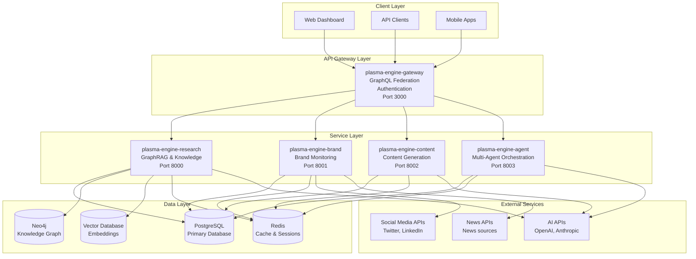
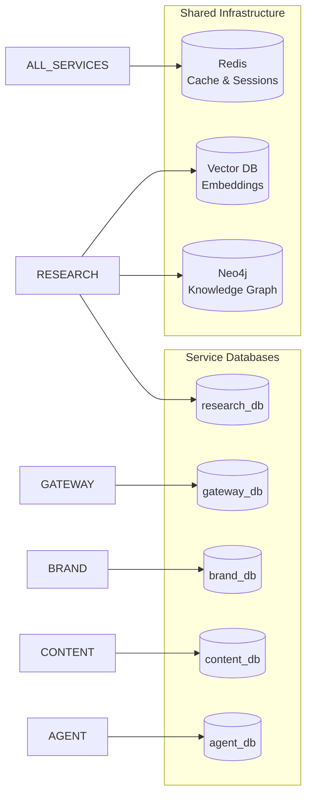
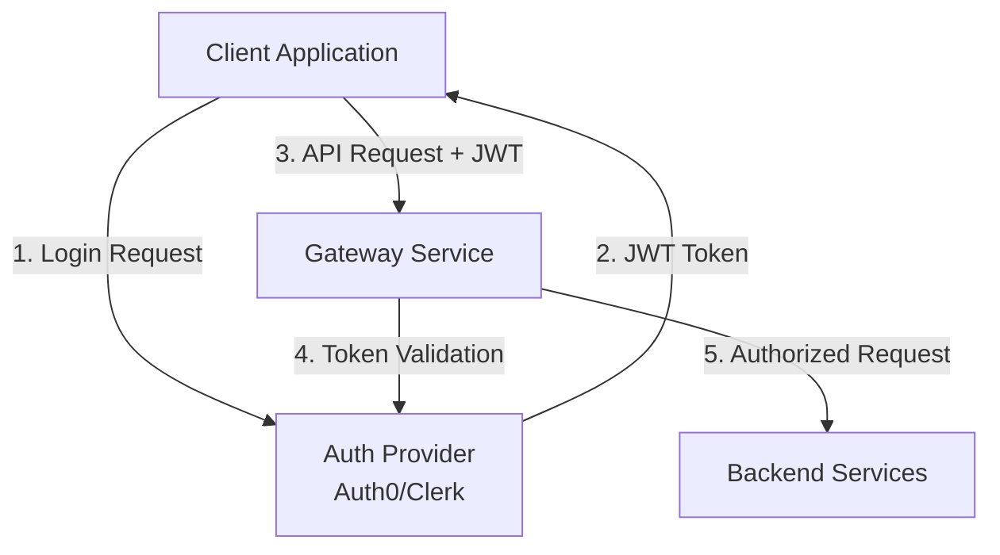
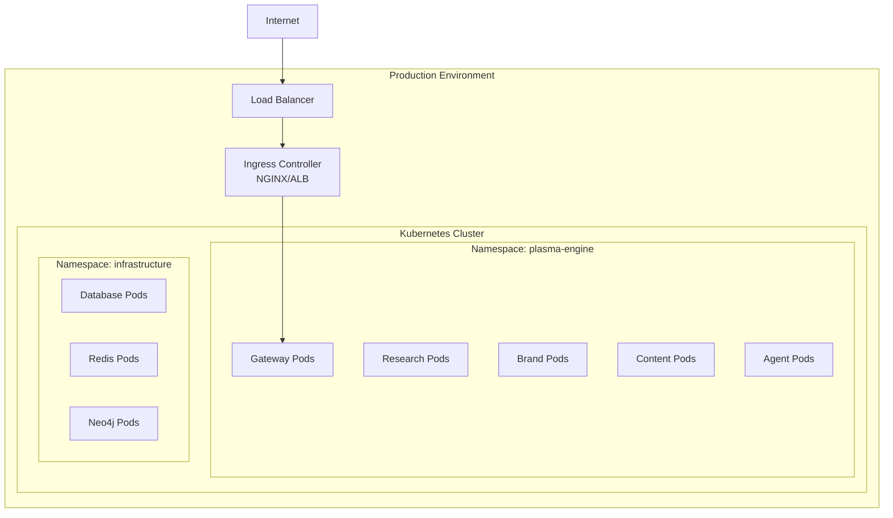
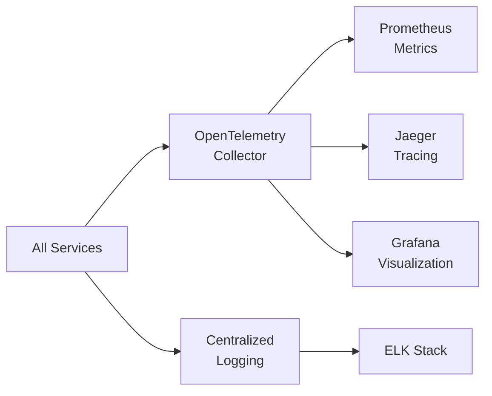

# Plasma Engine - System Architecture

## Overview

The Plasma Engine is an enterprise-grade AI platform designed for research automation, brand intelligence, and content orchestration. Built using a microservices architecture with GraphQL federation, the platform provides scalable, modular solutions for AI-driven business processes.

## High-Level Architecture

## Core Services

### 1. Gateway Service (`plasma-engine-gateway`)

**Purpose**: Centralized API gateway providing GraphQL federation, authentication, and request routing.

**Technology Stack**:
- TypeScript/Node.js
- Apollo Gateway
- Express.js
- GraphQL Federation

**Key Responsibilities**:
- User authentication and authorization
- GraphQL schema federation
- Request routing and load balancing
- Rate limiting and security
- Centralized logging and monitoring

**Port**: 3000

### 2. Research Service (`plasma-engine-research`)

**Purpose**: Advanced knowledge management system with GraphRAG capabilities for automated research and synthesis.

**Technology Stack**:
- Python/FastAPI
- LangChain & LlamaIndex
- Neo4j (Knowledge Graph)
- Vector databases (Pinecone/pgvector)
- Celery for async processing

**Key Responsibilities**:
- Document ingestion and processing
- Knowledge graph construction
- Vector similarity search
- GraphRAG query processing
- Automated research synthesis
- Parallel search orchestration

**Port**: 8000

### 3. Brand Service (`plasma-engine-brand`)

**Purpose**: Comprehensive brand monitoring, sentiment analysis, and competitive intelligence platform.

**Technology Stack**:
- Python/FastAPI
- Transformers & spaCy
- PostgreSQL
- Redis for caching
- ETL pipelines

**Key Responsibilities**:
- Social media monitoring
- Sentiment analysis
- Brand mention tracking
- Competitive analysis
- Reputation reporting
- Alert systems

**Port**: 8001

### 4. Content Service (`plasma-engine-content`)

**Purpose**: AI-powered content generation, planning, and publishing orchestration.

**Technology Stack**:
- Python/FastAPI
- OpenAI & Anthropic APIs
- PostgreSQL
- Redis queues
- Template engines

**Key Responsibilities**:
- Content strategy planning
- AI content generation
- Brand voice compliance
- Content scheduling
- Multi-platform publishing
- Performance analytics

**Port**: 8002

### 5. Agent Service (`plasma-engine-agent`)

**Purpose**: Multi-agent orchestration platform with MCP (Model Context Protocol) support for automated workflows.

**Technology Stack**:
- Python/FastAPI
- Multi-agent frameworks
- MCP protocol support
- Playwright for browser automation
- Celery for task orchestration

**Key Responsibilities**:
- Agent workflow design
- Task orchestration and coordination
- Browser automation
- API integrations
- Checkpoint/resume functionality
- Parallel execution management

**Port**: 8003

## Data Architecture

### Database Strategy

Each service maintains its own database for data isolation and service independence:

### Data Flow Patterns

1. **Synchronous Communication**: Direct HTTP/GraphQL calls for real-time operations
2. **Asynchronous Processing**: Redis-based pub/sub for background tasks
3. **Event Sourcing**: Critical operations logged for audit and replay
4. **Caching Strategy**: Multi-level caching with Redis for performance

## Security Architecture

### Authentication & Authorization

### Security Layers

1. **Network Security**: VPC isolation, security groups
2. **Application Security**: JWT authentication, RBAC authorization
3. **Data Security**: Encryption at rest and in transit
4. **API Security**: Rate limiting, input validation, CORS
5. **Infrastructure Security**: Container scanning, secrets management

## Scalability & Performance

### Horizontal Scaling

- **Service Independence**: Each service can scale independently
- **Load Balancing**: NGINX/ALB for traffic distribution
- **Database Scaling**: Read replicas, connection pooling
- **Caching**: Multi-tier caching strategy

### Performance Optimization

- **Async Processing**: Background jobs for heavy operations
- **Query Optimization**: Database indexing, query analysis
- **CDN Integration**: Static asset delivery
- **Connection Pooling**: Database connection management

## Deployment Architecture

### Container Strategy

### Environment Strategy

1. **Development**: Docker Compose for local development
2. **Staging**: Kubernetes cluster with reduced resources
3. **Production**: Full Kubernetes deployment with HA
4. **Testing**: Isolated environments for CI/CD

## Monitoring & Observability

### Observability Stack

### Key Metrics

- **Service Health**: Uptime, response times, error rates
- **Business Metrics**: API usage, user engagement, task completion
- **Resource Metrics**: CPU, memory, disk usage
- **Security Metrics**: Failed authentications, rate limiting hits

## Development Patterns

### API Design

- **GraphQL First**: Schema-driven development
- **Federated Architecture**: Each service owns its domain
- **Versioning Strategy**: Backward compatibility with deprecation
- **Documentation**: Auto-generated from schema

### Code Organization

- **Domain-Driven Design**: Services organized by business capability
- **Clean Architecture**: Separation of concerns, testability
- **Shared Libraries**: Common utilities in `plasma-engine-shared`
- **Configuration**: Environment-based configuration management

## Integration Patterns

### External Integrations

- **AI Services**: OpenAI, Anthropic, Stability AI
- **Social Media**: Twitter, LinkedIn, Facebook APIs
- **News Sources**: RSS feeds, news APIs
- **Analytics**: Google Analytics, custom tracking
- **Notification**: Email, Slack, webhook integrations

### Inter-Service Communication

- **Synchronous**: GraphQL for client-facing APIs
- **Asynchronous**: Event-driven with Redis pub/sub
- **Batch Processing**: Scheduled jobs for bulk operations
- **Circuit Breakers**: Fault tolerance patterns

## Future Architecture Considerations

### Planned Enhancements

1. **Event Streaming**: Apache Kafka for high-volume events
2. **Machine Learning**: Model serving infrastructure
3. **Mobile Backend**: Dedicated mobile API layer
4. **Edge Computing**: CDN and edge processing
5. **Multi-Region**: Geographic distribution

### Technology Evolution

- **Service Mesh**: Istio for advanced traffic management
- **Serverless**: Function-as-a-Service for specific workloads
- **GraphQL Subscriptions**: Real-time updates
- **Advanced Analytics**: Real-time data processing

---

This architecture provides a solid foundation for the Plasma Engine platform while maintaining flexibility for future growth and evolution.