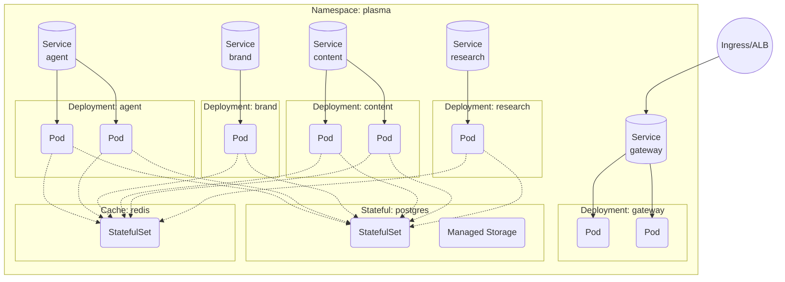
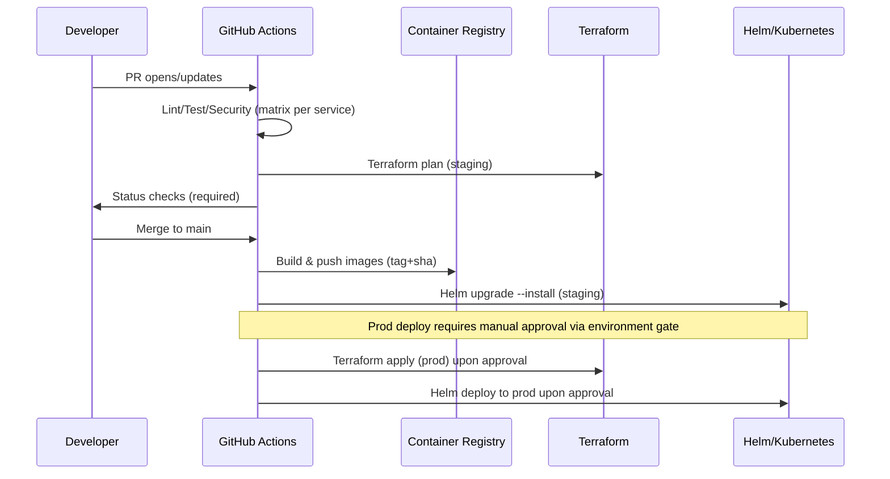

## Plasma Engine – Target-State Architecture (Draft)

This document captures the target deployable architecture for the Plasma Engine platform. Diagrams are provided in Mermaid for portability. All components and decisions are commentary-rich to support handoff to engineers.

### High-level context

```mermaid
flowchart LR
  subgraph Clients
    U1[Web
    UI]
    U2[CLI]
    U3[Automation/
    Schedulers]
  end

  U1-- HTTPS --> G[API Gateway]
  U2-- HTTPS --> G
  U3-- HTTPS --> G

  subgraph Kubernetes Cluster (EKS/GKE/AKS)
    G
    A[plasma-engine-agent]
    B[plasma-engine-brand]
    C[plasma-engine-content]
    R[plasma-engine-research]

    Q[Async Queue
    (SQS/RabbitMQ/Kafka)]
    W[Workers]
  end

  DB[(Postgres)]
  Cache[(Redis)]
  Obj[(Object Storage
  e.g., S3)]

  G <--> A
  G <--> B
  G <--> C
  G <--> R

  A <--> Q
  B <--> Q
  C <--> Q
  R <--> Q
  W <--> Q

  A <--> DB
  B <--> DB
  C <--> DB
  R <--> DB

  A <--> Cache
  B <--> Cache
  C <--> Cache
  R <--> Cache

  A --- Obj
  B --- Obj
  C --- Obj
  R --- Obj

  subgraph Observability
    P[Prometheus Operator]
    L[Loki]
    T[Tempo/Jaeger]
    O[OpenTelemetry Collector]
    Gr[Grafana]
  end

  O <-- OTLP --> A
  O <-- OTLP --> B
  O <-- OTLP --> C
  O <-- OTLP --> R
  O <-- OTLP --> G
  O --> P
  O --> L
  O --> T
  Gr <--> P
  Gr <--> L
  Gr <--> T
```

Notes:
- API Gateway provides routing, authz/authn, rate-limits, and observability headers.
- Core services run in a managed Kubernetes cluster. Async jobs are handled via a queue + worker pool.
- Data plane includes Postgres, Redis, and Object Storage. Replace with cloud provider equivalents as required.
- Observability follows OpenTelemetry-first collection with Prometheus/Loki/Tempo (or Jaeger) backends and Grafana dashboards.

### Kubernetes deployment view



Assumptions:
- Managed database/cache services are preferred in production. For local/dev clusters, use Helm charts for Postgres/Redis with persistence classes.
- Ingress is backed by cloud ALB/NLB depending on need. TLS termination at the ingress with mTLS used internally for sensitive services.

### Deployment pipeline overview



References:
- OpenTelemetry Collector and OTLP: `https://opentelemetry.io/docs/collector/`
- Prometheus Operator (kube-prometheus-stack): `https://github.com/prometheus-operator/kube-prometheus`
- Loki/Tempo/Grafana: `https://grafana.com/oss/`
- CNCF TAG Observability best practices: `https://github.com/cncf/tag-observability`

