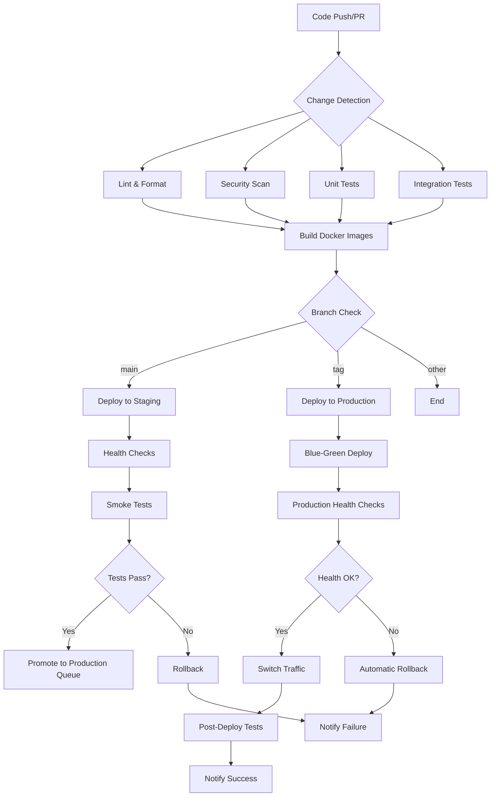
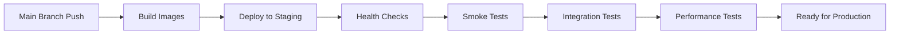
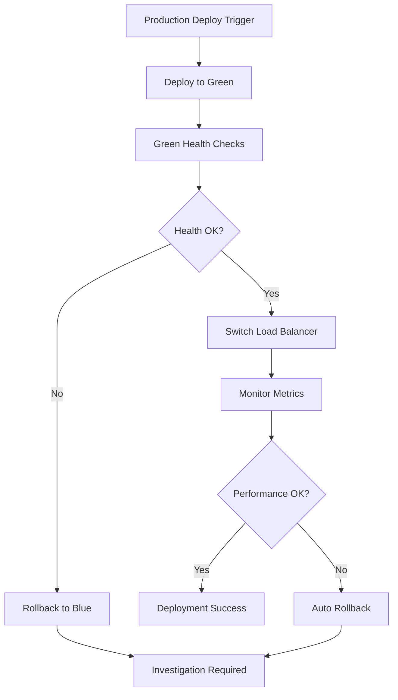

# CI/CD Architecture

This document describes the comprehensive CI/CD pipeline architecture for the Plasma Engine project.

## Overview

The Plasma Engine CI/CD pipeline is designed for:
- **Multi-service architecture** (5 services: gateway, research, brand, content, agent)
- **Parallel execution** for optimal performance
- **Security-first approach** with comprehensive scanning
- **Blue-green deployments** with automatic rollback
- **Infrastructure as Code** principles

## Pipeline Architecture



## Services Overview

### Service Types
1. **Gateway Service** (Node.js/TypeScript)
   - GraphQL API gateway
   - Apollo Server with Federation
   - Port: 3000

2. **Python Services** (FastAPI)
   - Research Service (Port: 8000)
   - Brand Service (Port: 8001)
   - Content Service (Port: 8002)
   - Agent Service (Port: 8003)

## CI Pipeline Stages

### 1. Change Detection
- **Purpose**: Optimize build times by detecting which services changed
- **Technology**: GitHub Actions `dorny/paths-filter`
- **Outputs**: Boolean flags for each service

```yaml
gateway: plasma-engine-gateway/**
research: plasma-engine-research/**
brand: plasma-engine-brand/**
content: plasma-engine-content/**
agent: plasma-engine-agent/**
```

### 2. Quality Gates (Parallel Execution)

#### A. Lint and Format
- **Python**: black, ruff, mypy, isort
- **Node.js**: ESLint, Prettier, TypeScript compiler
- **Duration**: ~2-3 minutes per service
- **Failure Action**: Block pipeline progression

#### B. Security Scanning
- **Tools**:
  - Bandit (Python security)
  - npm audit (Node.js vulnerabilities)
  - Snyk (comprehensive vulnerability scanning)
  - Semgrep (SAST analysis)
- **Duration**: ~3-4 minutes per service
- **Failure Action**: Block pipeline if high-severity issues found

#### C. Testing
- **Unit Tests**: Jest/Vitest (Gateway), pytest (Python services)
- **Coverage Threshold**: 90%
- **Integration Tests**: Service-to-service communication
- **Duration**: ~5-8 minutes per service
- **Parallel Execution**: Up to 5 services simultaneously

### 3. Build Stage
- **Multi-stage Dockerfiles** for optimized images
- **Security**: Non-root users, minimal base images
- **Registry**: GitHub Container Registry (GHCR)
- **Caching**: GitHub Actions cache for faster builds

## CD Pipeline Stages

### Staging Deployment



#### Staging Environment
- **URL**: `https://staging.plasma-engine.dev`
- **Purpose**: Pre-production validation
- **Database**: Staging PostgreSQL instance
- **Auto-deployment**: On merge to `main`

#### Health Checks
```bash
# Example health check endpoints
GET /health        # Service health
GET /ready         # Ready for traffic
GET /metrics       # Prometheus metrics
```

### Production Deployment

#### Blue-Green Strategy
1. **Blue Environment**: Current production
2. **Green Environment**: New deployment
3. **Traffic Switch**: Atomic cutover
4. **Rollback**: Instant switch back to blue



#### Production Triggers
- **Automatic**: Git tags matching `v*.*.*`
- **Manual**: Workflow dispatch with environment selection
- **Approval Required**: Production environment protection rules

### Rollback Mechanism

#### Automatic Rollback Triggers
- Health check failures
- Error rate threshold exceeded (>5%)
- Response time degradation (>2x baseline)
- Memory/CPU usage spikes

#### Manual Rollback
```bash
# Emergency rollback command
kubectl rollout undo deployment/plasma-engine-gateway
kubectl rollout undo deployment/plasma-engine-research
```

## Security Architecture

### Secret Management
- **GitHub Secrets** for sensitive configuration
- **Environment-specific secrets** (staging/production)
- **Secret rotation** every 90 days

### Container Security
- **Base Images**: Official minimal images (alpine, slim)
- **Non-root Users**: All containers run as non-privileged users
- **Vulnerability Scanning**: Trivy integration
- **Runtime Security**: Security contexts enforced

### Network Security
- **TLS Everywhere**: HTTPS for all external communication
- **Service Mesh**: Istio for service-to-service communication
- **Network Policies**: Kubernetes network policies

## Monitoring and Observability

### Metrics Collection
- **Application Metrics**: Prometheus
- **Infrastructure Metrics**: Node Exporter
- **Custom Metrics**: Service-specific KPIs

### Logging
- **Structured Logging**: JSON format
- **Log Aggregation**: ELK Stack or similar
- **Log Levels**: INFO (production), DEBUG (staging)

### Alerting
- **Performance**: Response time, error rates
- **Infrastructure**: CPU, memory, disk usage
- **Security**: Failed authentication, unusual access patterns

### Dashboard
- **Grafana Dashboards**: Service health, performance metrics
- **Business Metrics**: API usage, user activity
- **SLA Monitoring**: Uptime, availability metrics

## Performance Optimization

### Build Performance
- **Parallel Execution**: 5 services build simultaneously
- **Docker Layer Caching**: GitHub Actions cache
- **Dependency Caching**: npm/pip cache layers
- **Multi-stage Builds**: Separate build and runtime stages

### Deployment Performance
- **Rolling Updates**: Zero-downtime deployments
- **Resource Limits**: Proper CPU/memory allocation
- **Auto-scaling**: HPA based on CPU/memory usage
- **CDN Integration**: Static asset optimization

## Environment Configuration

### Development
```yaml
Environment: development
Replicas: 1
Resources:
  CPU: 100m
  Memory: 256Mi
Database: Local PostgreSQL
Cache: Local Redis
```

### Staging
```yaml
Environment: staging
Replicas: 2
Resources:
  CPU: 500m
  Memory: 1Gi
Database: Managed PostgreSQL
Cache: Managed Redis
Load Balancer: Internal
```

### Production
```yaml
Environment: production
Replicas: 3
Resources:
  CPU: 1000m
  Memory: 2Gi
Database: HA PostgreSQL Cluster
Cache: Redis Cluster
Load Balancer: External with SSL
Auto-scaling: 3-10 replicas
```

## Disaster Recovery

### Backup Strategy
- **Database**: Daily backups with 30-day retention
- **Code**: Git repository mirrors
- **Container Images**: Multi-region registry replication

### Recovery Procedures
1. **Service Failure**: Auto-restart, fallback to previous version
2. **Database Failure**: Failover to replica, restore from backup
3. **Complete Outage**: Multi-region deployment activation

### RTO/RPO Targets
- **RTO (Recovery Time Objective)**: 15 minutes
- **RPO (Recovery Point Objective)**: 1 hour
- **Data Loss**: Maximum 1 hour of data

## Compliance and Auditing

### Audit Trail
- All deployments logged and tracked
- Change approvals documented
- Security scan results archived

### Compliance Requirements
- SOC 2 Type II compliance considerations
- GDPR data protection measures
- Regular security assessments

## Tools and Technologies

### CI/CD Platform
- **Primary**: GitHub Actions
- **Runners**: GitHub-hosted Ubuntu
- **Secrets**: GitHub Secrets Manager

### Container Platform
- **Registry**: GitHub Container Registry (GHCR)
- **Orchestration**: Kubernetes
- **Service Mesh**: Istio (future)

### Monitoring Stack
- **Metrics**: Prometheus + Grafana
- **Logging**: ELK Stack
- **APM**: Application Performance Monitoring tools
- **Alerting**: AlertManager + PagerDuty

### Security Tools
- **SAST**: Semgrep, CodeQL
- **Container Scanning**: Trivy
- **Dependency Scanning**: Snyk, Dependabot
- **Secret Scanning**: GitHub Advanced Security

## Migration Plan

### Current State
- Basic CI/CD with manual deployment steps
- Limited security scanning
- Manual testing procedures

### Target State (Phase 1)
- Automated CI/CD with quality gates
- Comprehensive security scanning
- Automated testing and deployment

### Target State (Phase 2)
- Advanced monitoring and alerting
- Auto-scaling and self-healing
- Multi-region deployment

### Implementation Timeline
- **Week 1-2**: CI pipeline automation
- **Week 3-4**: CD pipeline with staging
- **Week 5-6**: Production deployment automation
- **Week 7-8**: Monitoring and alerting setup

## Troubleshooting Guide

### Common Issues
1. **Build Failures**: Check dependency versions, clear cache
2. **Test Failures**: Review test logs, check database state
3. **Deployment Failures**: Verify secrets, check resource limits
4. **Health Check Failures**: Review service logs, check dependencies

### Debug Commands
```bash
# Check pipeline status
gh workflow list
gh run list --workflow=ci.yml

# View service logs
kubectl logs deployment/plasma-engine-gateway
kubectl describe pod <pod-name>

# Check resource usage
kubectl top pods
kubectl get hpa
```

## Future Enhancements

### Planned Improvements
- **GitOps**: ArgoCD for declarative deployments
- **Progressive Delivery**: Canary deployments with Flagger
- **Chaos Engineering**: Litmus for resilience testing
- **Advanced Security**: Runtime threat detection

### Technology Evaluations
- **Service Mesh**: Istio vs Linkerd
- **Monitoring**: Datadog vs New Relic
- **CI/CD**: GitHub Actions vs GitLab CI

---

## Contact Information

**DevOps Team**: devops@plasma-engine.dev
**On-Call**: Use PagerDuty escalation procedures
**Documentation**: Update this document with any architecture changes